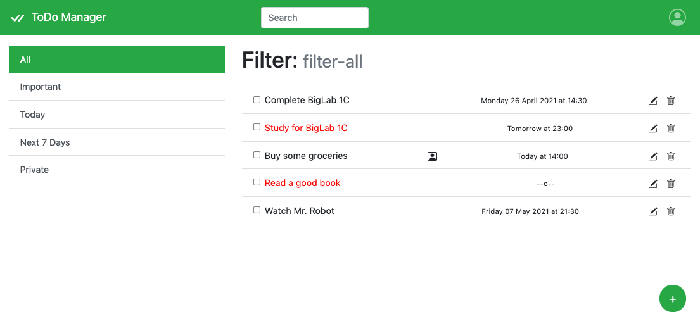

# BigLab 1 - Responsive

We designed this version of the BigLab 1 to work with devices of different sizes.

All the texts of the BigLab1 are available inside the [course-materials repository](https://github.com/polito-WA1-AW1-2021/course-materials/tree/main/labs/BigLab1).

## ToDo List in React

During the four weeks of the first BigLab, you will develop the front-end for a web-based task manager using [React](https://reactjs.org). To create your repository, you must login to [GitHub Classroom](https://classroom.github.com/) and create or join your group. For more details, please have a look at the [GitHub Classroom instructions](https://github.com/polito-WA1-AW1-2021/course-materials/blob/main/labs/GH-Classroom-BigLab-Instructions.pdf). 

Here you can find the links for the BigLab repository on GitHub Classroom:

* Web Applications I: https://classroom.github.com/g/Pxim-2Bu
* Applicazioni Web I [A-L]: https://classroom.github.com/g/hpJQI5GQ 
* Applicazioni Web I [M-Z]: https://classroom.github.com/g/bEZrEEhs

To better keep track of your progress, we suggest you work incrementally “week-by-week”, e.g., by creating, inside your repository, a branch for each week of the BigLab.

## What are we building in these weeks?

1. [During the first week](https://github.com/polito-WA1-AW1-2021/course-materials/blob/main/labs/BigLab1/BigLab1a.pdf), you will start setting up the front-end for the task manager. To do so, you will use the [React-enabled version of Bootstrap](https://react-bootstrap.github.io/). The page has to be static; you do not have to implement any user actions. For the visual appearance of the web application, you can get inspiration from the screenshot in the next page.
2. [In the second week](https://github.com/polito-WA1-AW1-2021/course-materials/blob/main/labs/BigLab1/BigLab1b.pdf), you will re-structure your web-based task manager to exploit the component-based approach of the React framework. Specifically, you will divide your application into different components, and you will identify the state and props required to store and visualize tasks, starting from the tasks data structure.
3. [During the third week](https://github.com/polito-WA1-AW1-2021/course-materials/blob/main/labs/BigLab1/BigLab1c.pdf), you will implement the filters (i.e., important, today, next 7 days, private), and you will add the possibility to create and add new tasks.
4. [In the last week](https://github.com/polito-WA1-AW1-2021/course-materials/blob/main/labs/BigLab1/BigLab1d.pdf), you will learn how to restructure your application to use routes for supporting multiple “pages”, e.g., by developing a different route for each filter. Furthermore, you will allow users to delete and edit tasks.

## Evaluation Criteria & Deadlines

The points received for your work are added to the final exam score to each member of the team.

We will follow these evaluation criteria for evaluating your submission:

* The team members will receive 1 point if the submitted React application is *complete*, i.e., it successfully implements *all functionalities of the 4 weeks*, i.e., points 1), 2), 3), and 4).
* The team members will receive 0.5 points if the submitted React application is *partially* *complete*, i.e., it successfully implements the functionalities of *at least 2 weeks* (e.g., the team implemented only points 1) and 2)). 
* The team members will receive 0 points otherwise.

The assignment must be submitted in the master/main branch before **Sunday, May 9 at 23:59 CEST** (see the the GitHub Classroom instructions for the details on the submission procedure).

## Example screenshot

Note: the actual layout and appearance of your application may be different from the screenshot. Only the functionality mentioned in the 4 points is mandatory, while you may freely choose the graphical presentation.

